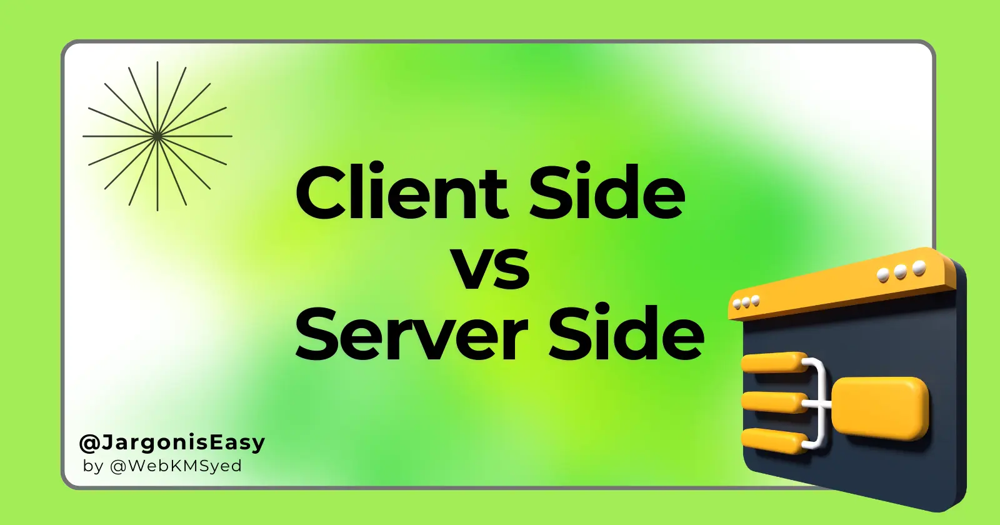
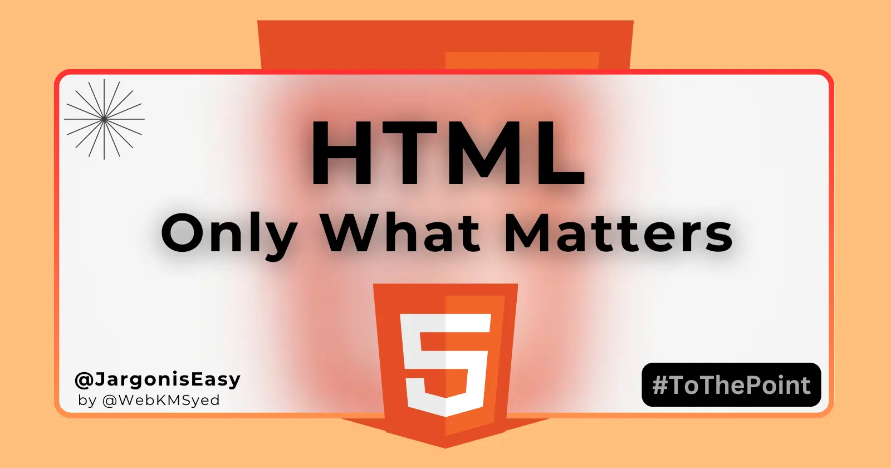
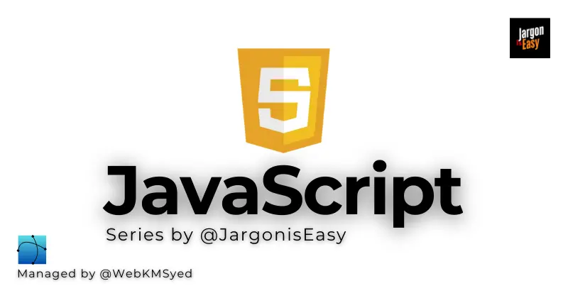
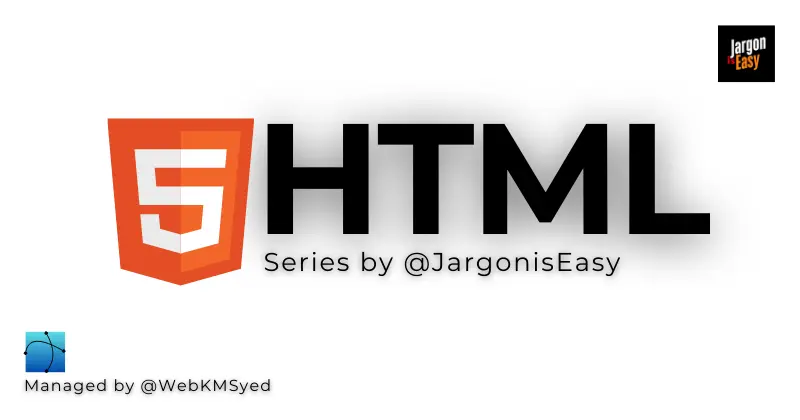

### Hi there, I'm **Khishamuddin Syed** 👋

> **Learn. Think. Design. Develop.**

I am a passionate **Web Developer & Designer** currently learning at **Chai Code Cohort** ☕ and working on exciting projects. Always exploring new tech & sharing knowledge!

---

### 🚀 Skills & Tech Stack:

---

### 📌 Current Status:
- 🚀 **Currently Learning:** Chai Code Cohort
- 🔧 **Working On:** New Web Development Project

---

### 🌎 Connect with Me:

---

### 📝 Blogs & Websites:
- 🌍 **Personal Site:** [webkmsyed.com](https://webkmsyed.com)
- 📖 **Tech Blog:** [jargoniseasy.com](https://jargoniseasy.com)

---

### 🔥 Top Posts

<table>
  <tr>
    <td align="center">
      
       Client vs Server
    </td>
    <td align="center">
      
       HTTP vs HTTPS
    </td>
    <td align="center">
      
       HTML Short Notes
    </td>
  </tr>
</table>

### 📚 Series

<table>
  <tr>
    <td align="center">
      
       JavaScript Series
    </td>
    <td align="center">
      
       CSS Series
    </td>
    <td align="center">
      
       HTML Series
    </td>
  </tr>
</table>

---

### 🏆 Other Profiles:

---

### 📊 GitHub Stats:

  

 

  &nbsp;&nbsp;
  

---

> **"Keep Learning, Keep Building! 🚀"**
